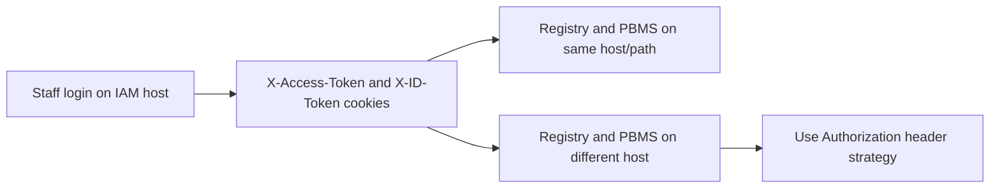

# Staff Portal Login and SSO Flow 

## Purpose

This document explains how staff login works in the current Authlib-first IAM setup, with endpoint contracts and SSO behavior across OpenG2P services (for example, Registry and PBMS).

---

## Quick summary

- Login flow is OAuth2 Authorization Code + OIDC, implemented via Authlib in `iam-core`.
- Staff portal auth endpoints are under `/auth/*`.
- On callback, backend sets:
  - `X-Access-Token` (cookie)
  - `X-ID-Token` (cookie)
- Protected APIs validate these tokens using issuer/audience rules and provider metadata/JWKS.
- One-login-for-many-services works if services share cookie context and trust the same IdP + claims.

---

## Main components

- Staff controller:
  - `iam-staff-portal-api/src/openg2p_iam_staff_api/controllers/auth_controller.py`
- Core orchestration:
  - `iam-core/src/openg2p_iam_core/services/auth_facade.py` (class `AuthService`)
- Provider lookup:
  - `iam-core/src/openg2p_iam_core/services/provider_repository.py`
- OIDC/Authlib integration:
  - `iam-core/src/openg2p_iam_core/user_auth/oidc_service.py`
- Token validation dependency:
  - `iam-core/src/openg2p_iam_core/user_auth/dependencies.py`
  - `iam-core/src/openg2p_iam_core/services/token_validator_service.py`

---

## End-to-end staff login flow

```mermaid
sequenceDiagram
  participant Browser
  participant StaffUI as StaffFrontend
  participant StaffAPI as StaffPortalAPI
  participant Core as IAMCoreAuthService
  participant IdP as OIDCProvider

  StaffUI->>StaffAPI: GET /auth/get_login_providers
  StaffAPI->>Core: get_login_providers(user_type="staff")
  Core-->>StaffAPI: provider list
  StaffAPI-->>StaffUI: 200 loginProviders[]

  StaffUI->>StaffAPI: POST /auth/start_authentication_transaction?id=<provider_id>&redirect_uri=<ui_return_url>
  StaffAPI->>Core: start_authentication_transaction(provider_id, redirect_uri)
  Core-->>StaffAPI: redirectUrl + state
  StaffAPI-->>StaffUI: 200 {redirectUrl,state}
  StaffUI->>IdP: Browser redirect to redirectUrl

  IdP-->>StaffAPI: GET /auth/callback?code=...&state=...
  StaffAPI->>Core: complete_authentication_transaction(state, code)
  Core->>IdP: token endpoint call (Authlib)
  IdP-->>Core: access_token + id_token (+expires_in)
  Core-->>StaffAPI: tokens + redirect_uri
  StaffAPI-->>Browser: Set-Cookie X-Access-Token + X-ID-Token; 302 redirect

  StaffUI->>StaffAPI: GET /auth/get_user_profile (with cookies)
  StaffAPI->>Core: validate via dependencies/token validator
  StaffAPI-->>StaffUI: staff principal profile
```


---

## API contracts (staff auth)

All routes are registered with controller prefix `/auth`.

### 1) Get login providers

- **Endpoint:** `GET /auth/get_login_providers`
- **Purpose:** Return login providers available to `staff`.
- **Response example:**

```json
{
  "loginProviders": [
    {
      "id": 1,
      "name": "Keycloak Staff",
      "protocol": "oidc",
      "displayName": "Sign in with Staff SSO",
      "displayIconUrl": "data:image/png;base64,..."
    }
  ]
}
```

### 2) Start authentication transaction

- **Endpoint:** `POST /auth/start_authentication_transaction`
- **Query params:**
  - `id` (required, int): login provider id
  - `redirect_uri` (optional, string): where UI should return after callback
- **Purpose:** Create transaction (`state`, `nonce`, `code_verifier`) and return provider auth URL.
- **Response example:**

```json
{
  "redirectUrl": "https://idp.example.com/authorize?...&state=...&nonce=...&code_challenge=...",
  "state": "random-state"
}
```

### 3) Direct redirect variant

- **Endpoint:** `GET /auth/get_login_provider_redirect/{id}?redirect_uri=/...`
- **Purpose:** Server directly returns 302 to provider authorize URL.
- **Response:** `302` redirect.

### 4) Callback from OIDC provider

- **Endpoint:** `GET /auth/callback`
- **Query params from IdP:**
  - `code`
  - `state`
- **Backend behavior:**
  - validates transaction and nonce
  - exchanges code for tokens via Authlib
  - sets cookies:
    - `X-Access-Token`
    - `X-ID-Token`
  - redirects to original `redirect_uri`
- **Response:** `302` redirect with cookies set.

### 5) Get staff profile (protected)

- **Endpoint:** `GET /auth/get_user_profile`
- **Auth input:** `Authorization: Bearer <token>` header or `X-Access-Token` cookie.
- **Checks:**
  - token issuer/audience
  - JWT signature/JWKS (or introspection/hybrid by config)
  - `require_user_type("staff")`
- **Response example:**

```json
{
  "scheme": "bearer",
  "iss": "https://idp.example.com/realms/staff",
  "sub": "uuid-user-id",
  "user_type": "staff",
  "aud": "staff-portal",
  "iat": "2026-03-12T10:01:02Z",
  "exp": "2026-03-12T11:01:02Z",
  "roles": ["staff", "registry_admin"],
  "provider": "https://idp.example.com/realms/staff"
}
```

### 6) Logout

- **Endpoint:** `POST /auth/logout`
- **Behavior:** Deletes `X-Access-Token` and `X-ID-Token` cookies.

---

## One login across Registry/PBMS/etc (SSO behavior)

## Requirement model

To get true login once, access many OpenG2P services:

1. All services validate tokens against the same trusted IdP issuer(s).
2. All services enforce compatible audience/claim rules.
3. Browser sends same auth cookie/token context to each service.
4. CORS/credentials are enabled correctly for browser calls.

## Important current constraint

Current cookie write uses no explicit `domain` attribute (host cookie).  
That means cross-service SSO works naturally when services are under the same host (for example path-based routing), but not automatically across unrelated hosts/subdomains.

If Registry/PBMS are separate hosts, use either:

- a shared parent domain cookie strategy (code/config update to set cookie domain), or
- frontend-held bearer token + `Authorization` header to each service.

### Option A: Shared parent domain cookie (recommended when subdomains are controlled)

Use one parent domain like `.openg2p.org` so browser sends cookies to:

- `staff.openg2p.org`
- `registry.openg2p.org`
- `pbms.openg2p.org`

#### Backend config and cookie set example

Add a cookie domain config in settings (example):

```python
# iam-core/src/openg2p_iam_core/user_auth/config.py
class Settings(BaseSettings):
    ...
    auth_cookie_domain: str | None = None  # e.g. ".openg2p.org"
```

Use it while setting cookies in each portal auth callback controller:

```python
# iam-staff-portal-api/.../controllers/auth_controller.py
response.set_cookie(
    "X-Access-Token",
    token_response["access_token"],
    max_age=_config.auth_cookie_max_age,
    expires=expires_in,
    path=_config.auth_cookie_path,
    domain=_config.auth_cookie_domain,  # important for cross-subdomain SSO
    httponly=_config.auth_cookie_httponly,
    secure=_config.auth_cookie_secure,
    samesite="none",  # set when cross-site frontend flows are needed
)
response.set_cookie(
    "X-ID-Token",
    token_response["id_token"],
    max_age=_config.auth_cookie_max_age,
    expires=expires_in,
    path=_config.auth_cookie_path,
    domain=_config.auth_cookie_domain,
    httponly=_config.auth_cookie_httponly,
    secure=_config.auth_cookie_secure,
    samesite="none",
)
```

Frontend call example with cookies:

```ts
await fetch("https://registry.openg2p.org/api/some-protected-route", {
  method: "GET",
  credentials: "include", // sends shared-domain cookies
});
```

### Option B: Frontend bearer token + Authorization header

Use this when hosts are different and shared cookies are not feasible.

#### Frontend example

```ts
// after callback, frontend gets token from a secure backend endpoint
const accessToken = sessionStorage.getItem("access_token");

const res = await fetch("https://pbms.example.net/api/protected", {
  method: "GET",
  headers: {
    Authorization: `Bearer ${accessToken}`,
  },
});
```

#### Backend behavior (already supported)

`JwtBearerAuth` accepts token from either:

- `Authorization: Bearer ...` header, or
- `X-Access-Token` cookie.

So no validator change is required for header mode.

```python
# iam-core/src/openg2p_iam_core/user_auth/dependencies.py
jwt_token = request.headers.get("Authorization", None) or request.cookies.get(
    "X-Access-Token", None
)
if jwt_token:
    jwt_token = jwt_token.removeprefix("Bearer ")
```

#### Security notes for header mode

- Prefer BFF pattern or short-lived tokens if possible.
- Avoid storing access token in `localStorage` when you can avoid it.
- Enforce HTTPS only.
- Configure CORS allow-list and allowed headers (`Authorization`).




---

## Configuration reference

## 1) Login provider data (DB/config)

Current provider model fields (`login_providers`) in `iam-core`:

- Required:
  - `id`
  - `user_type` (`staff|agent|beneficiary`)
  - `provider_name`
  - `client_id`
  - `oauth_callback_url`
  - `token_endpoint_auth_method`:
    - `client_secret_basic`
    - `client_secret_post`
    - `private_key_jwt`
    - `private_key_jwt_keymanager`
- Usually required unless using metadata discovery:
  - `authorization_endpoint`
  - `token_endpoint`
- Optional:
  - `server_metadata_url`
  - `userinfo_endpoint`
  - `jwks_uri`
  - `jwt_assertion_aud`
  - `client_secret`
  - `keymanager_app_id`
  - `keymanager_ref_id`
  - `scope`
  - `enable_pkce`
  - `extra_authorize_params`
  - UI fields `description`, `icon_base64`

## 2) Common auth settings

From `iam-core/src/openg2p_iam_core/user_auth/config.py`:

- `auth_enabled`
- `auth_default_issuers`
- `auth_default_audiences`
- `auth_cookie_max_age`
- `auth_cookie_set_expires`
- `auth_cookie_path`
- `auth_cookie_httponly`
- `auth_cookie_secure`

Per-route auth policy (`ApiAuthSettings`) supports:

- `enabled`
- `issuers`
- `audiences`
- `claim_name`
- `claim_values`
- `validation_mode`: `jwt|introspection|hybrid`
- `introspection_endpoint`

## 3) Example provider config shape

```json
{
  "id": 1,
  "user_type": "staff",
  "provider_name": "Keycloak Staff",
  "client_id": "staff-portal-client",
  "client_secret": "secret",
  "token_endpoint_auth_method": "client_secret_post",
  "server_metadata_url": "https://idp.example.com/realms/staff/.well-known/openid-configuration",
  "oauth_callback_url": "https://portal.example.com/auth/callback",
  "scope": "openid profile email",
  "enable_pkce": true,
  "extra_authorize_params": "{\"prompt\": \"login\"}"
}
```

---

## FE integration checklist

- Call `GET /auth/get_login_providers` and show provider options.
- On click, call start endpoint and redirect browser to `redirectUrl`.
- Ensure callback route is reachable by backend.
- After callback redirect, call `GET /auth/get_user_profile` with credentials enabled.
- Handle 401/403 by restarting login.

---

## BE integration checklist

- Configure provider metadata and client auth method correctly.
- Set issuer/audience policies for each protected API.
- Use `require_user_type("staff")` and optional `has_claim`/`claim_in` for authorization.
- For multi-service SSO, align domain/routing/token propagation strategy early.

---

## Troubleshooting quick map

- `Unauthorized. Unknown Issuer`: issuer not in configured allow-list or provider not found.
- `Unauthorized. Unknown Audience`: token audience mismatch.
- `Nonce mismatch`: callback state/nonce flow broken or replayed.
- `Forbidden. Invalid userType`: token claims do not map to `staff`.
- `Forbidden. Claim(s) missing/don't match`: route claim policy mismatch.

